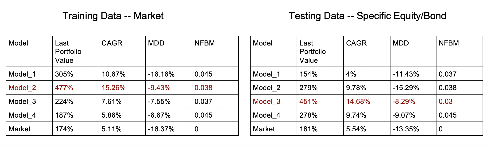

# DDPG for portfolio management

# Datasets

## Datasets preprocessing

### Run
```
DRL_Data_Preprocessing.ipynb
```

## Train DDPG model

## Training

### Run

```bash
python stock_trading.py -p lstm  -w 6 -b True -ts 20050301 -te 20161101
```
#### Usage

```
* -d print debug statement, default False
* -p predictor type, cnn or lstm
* -w observation window length, digit
* -b whether to use batch normalization, True or False
* -r rollout steps, default 2
* -s batch size, default 10
* -ts training set start date, betweeen 20050301 and 20161101'
* -te training set end date, betweeen 20050301 and 20161101'

```

## Results 

### Run 
```
ddpg_experiment.ipynb  #Get the portfolio weights during the training time

choose_specific_stocks_train.ipynb  #Get the name of specific stocks

train_choose_stocks.ipynb #Converting specific stocks information to real prices
```

### Then run
```
plot_the_result_of_testing_data_Training.ipynb
```
We used four models with different training times and the results are as follows, we found that model 2 performed well on training data (Market), while model 3 performed well on testing data (Specific)

* model1 : Epoch 5500
* model2 : Epoch 6200
* model1 : Epoch 7200
* model2 : Epoch 8200

* Last Portfolio value : Literally
* CAGR(Compound annual growth rate) : (Last Portfolio value - Beginning Portfolio value)**(1/n) - 1
* MDD(Max drawdown) : (Next month Portfolio value - This month Portfolio value) / This month Portfolio value
* NFBM(New fund by month) : e.g.(This month Portfolio weight has A & B stocks Next month have C stock, so the NFBM is 3)




## Testing

## Results

### Run 
```
ddpg_experiment.ipynb  #Get the portfolio weights during the testing time

choose_specific_stocks_test.ipynb  #Get the name of specific stocks

test_choose_stocks.ipynb #Convert specific stocks information to real prices
```
### Then run 
```
plot_the_result_of_testing_data_Testing.ipynb
```


Our model performed well in the testing dataset, which outperformed the market by 20 percents.

# Reference
* Code is from https://github.com/sino30535/DDPG-portfolio-management
